# Expense Tracker
Programming on the Internet 31748 Assignment 1 - Dynamic Web Interface to a Database System  
Chosen Project: Expense Tracker  

## Problem
<!-- a 2 line summary of problem this website solves -->
It can be overwhelming and tedious to manually track your day to day expenses.
This web app makes it possible to track and categorise your spending all in one place.
You can easily add all your past and upcoming expenses, as well as view your expenditure by categories and monthly trends.
This way you can even see what is costing you the most and make necessary cutbacks.

## How to Run
1. Clone the repo
```sh
git clone https://github.com/sazzh/expense-tracker-31748.git
cd expense-tracker-31748
```
2. Install dependencies
```sh
npm install

cd frontend
npm install

cd ../backend
uv sync
```
3. Run frontend and backend concurrently
```sh
cd ..
npm run dev
```
4. Navigate to `http://localhost:5173` and have fun!

## Tech Stack
<!-- illustration of technical stack, including frontend, styling, routing, data, and deployment (if applicable) -->
- Frontend: HTML/CSS, React with TypeScript, styled with Mantine UI, React Router for client-side navigation  
- Backend: Litestar (Python) serving a REST API with SQLAlchemy as the ORM and Uvicorn as the ASGI server  
- Data: SQLite database managed via SQLAlchemy, included as expensetracker.sqlite file  
- Tooling: Vite and npm for the frontend, uv for Python backend dependency management, concurrently to run both together  

<!--  -->


## Feature List
<!-- feature list - bullet point list such as 'Responsive mobile design', 'Dynamic filtering', 'Dark mode toggle' -->

## Folder Structure
<!-- brief folder structure explanation -->
This project is split into `frontend/` and `backend/` folders within a single repository.  
Further description of key folders and files are mentioned below.
```
expense-tracker-31748/
├── frontend/
|   ├── public/                 # assets
|   |   └── favicon.svg
|   ├── src/
|   |   ├── api/                # frontend fetch functions for backend endpoints
|   |   ├── components/         # reusable UI components
|   |   ├── pages/              # route-level components
|   |   ├── types/              # TypeScript types
|   |   ├── App.tsx             # root component
|   |   ├── main.tsx            # entry point, mounts app to DOM
|   |   ├── Router.tsx          # React Router route definitions
|   |   ├── index.css           # global styles
|   |   └── theme.ts            # Mantine theme config
|   ├── vite.config.ts
|   ├── package.json            # frontend dependencies
|   └── index.html              # root HTML file
├── backend/
|   ├── main.py                 # Litestar app, models, and routes
|   ├── expensetracker.sqlite   # local SQLite database file
|   ├── pyproject.toml          # Python dependencies
|   └── uv.lock
├── package.json                # root scripts (concurrently)
└── README.md                   
```

## Challenges Overcome
<!-- summary of challenges overcome - 4/5 sentences okay -->
